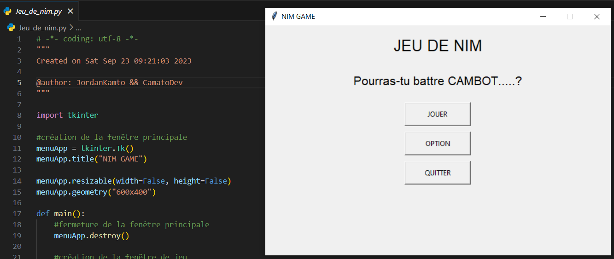

# Jeu de Nim avec Interface Graphique

## 📌 Description
Ce projet implémente le **jeu de Nim** en Python avec une interface utilisateur graphique créée avec Tkinter. Le joueur affronte une IA dans un cadre interactif.

## 🚀 Fonctionnalités
- Interface visuelle (allumettes restantes, actions)
- Interaction joueur vs machine
- Logique de jeu classique du Nim

## 🛠 Technologies
- Python
- Tkinter

## 📸 Apercu

